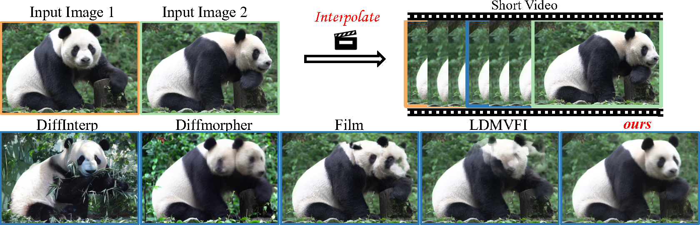

<p align="center">
  <h1 align="center">DreamNVS: Using Image Interpolation for Novel View Synthesis</h1>
  <p align="center">
    <strong>2024-2 Generative Artificial Intelligence</strong>
  </p>
  <p align="center">
    <strong>Team 0</strong>
  </p>
  <p align="center">
    <strong>2023-27692 이은호 (Eunho Lee)</strong>
    &emsp;&emsp;
    <strong> 2024-20878 정승훈 (Seunghoon Jeong) </strong>
  </p>
  <p align="center">
    <strong>2024-21384 조주환 (Juhwan Jo) </strong>
    &emsp;&emsp;
    <strong>2024-20986 장현수 (Hyunsu Jang) </strong>
  </p>

  <div align="center">
        
  </div>
</p>

## Installation
First, get codes from the repo
```
git clone --recursive https://github.com/HFTshoon/DreamNVS.git

# if you already clone the repo without submodules,
# git submodule update --init --recursive
```

Then, download following files
```
mkdir -p checkpoints/
wget https://download.europe.naverlabs.com/ComputerVision/MASt3R/MASt3R_ViTLarge_BaseDecoder_512_catmlpdpt_metric.pth -P checkpoints/
```

We provide Docker from dockerhub!
```
docker pull eunho112498/dreamnvs:1.0 
```

If you want to customize or make it on your own, follow below.

This code is tested in CUDA 11.8, python 3.9.

Make sure the python version is not below python 3.9 or above 3.10; It will not work.
```
cd DreamNVS
conda create -n dreamnvs python=3.9 cmake=3.31.0
conda activate dreamnvs
pip install -r requirement_dreammover.txt
conda install pytorch torchvision pytorch-cuda=11.8 -c pytorch -c 
pip install -r requirement_mast3r.txt
pip install -r requirement_dreamnvs.txt
cd ../
```
You can download the pretrained model Stable Diffusion v1.5 from [Huggingface](https://huggingface.co/runwayml/stable-diffusion-v1-5), and specify the `model_path` to your local directory.

[Optional] You can download the fine-tuned vae model from [Huggingface](https://huggingface.co/stabilityai/sd-vae-ft-mse) for better performance.


## Usage
To start with, run the following command to train a Lora for image pair:

This will generate `./guidance/spatial_guidance_model_dreambooth_lora.pth`, `./guidance/trajectory_guidance_model_dreambooth_lora.pth` and `./lora/lora_ckpt/demo/004/pytorch_lora_weights.bin`

Following weights are already included in the repo, so you don't have to do it if you just try the main inference.
```
# don't have to it because lora weights are already included
# python -m lora.train_dreambooth_lora --instance_data_dir ./demo/004/ --lora_rank 16 --spatial_guidance_path ./guidance/spatial_guidance_model.pth --trajectory_guidance_path ./guidance/trajectory_guidance_model.pth --train_spatial_encoder --train_trajectory_encoder --guide_mode guide_concat
```

After that, we now can run the main code:
```
python main.py \
 --img_path ./demo/004 --lora_path ./lora/lora_ckpt/demo/004 \
 --spatial_guidance_path ./guidance/spatial_guidance_model.pth \
 --trajectory_guidance_path ./guidance/trajectory_guidance_model.pth \
 --spatial_guidance_lora_path ./guidance/spatial_guidance_model_dreambooth_lora.pth \
 --trajectory_guidance_lora_path ./guidance/trajectory_guidance_model_dreambooth_lora.pth
```

## Acknowledgement
This code borrows heavily from [DreamMover](https://github.com/leoShen917/DreamMover), [GaussianObject](https://github.com/chensjtu/GaussianObject) and [Diffusers](https://github.com/huggingface/diffusers). We thank the respective authors for open sourcing their method.